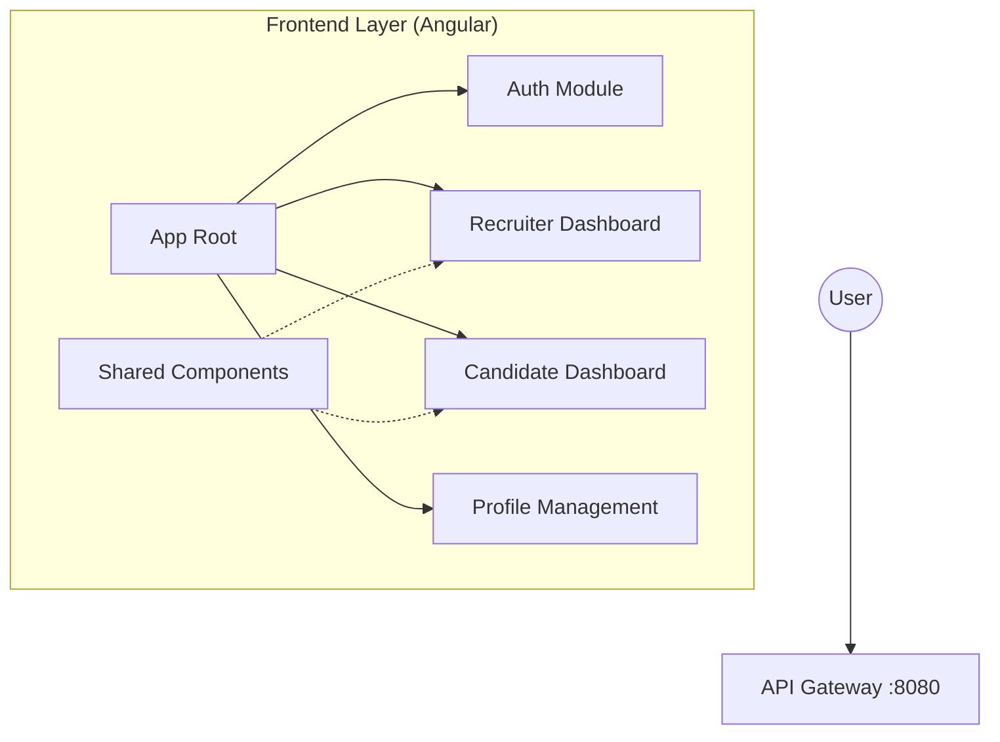
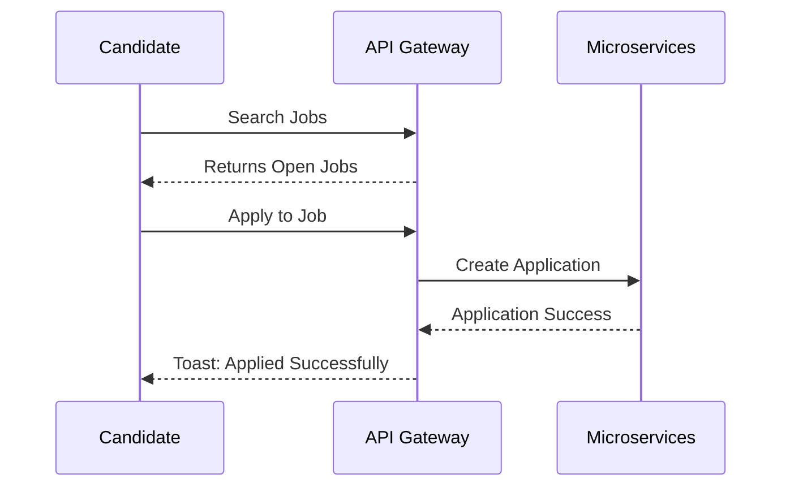

<!-- [Disha Gujar]: Added READ.md file -->
# HireConnect — Frontend Platform

HireConnect is a state-of-the-art recruitment platform designed to bridge the gap between talented candidates and top-tier recruiters. This repository contains the professional, high-performance Angular frontend for the HireConnect ecosystem.

## 🚀 Overview

The frontend is meticulously crafted with a focus on user experience, inspired by industry leaders like Naukri.com. It provides dedicated dashboards and workflows for both recruiters and candidates, ensuring a streamlined hiring process from job posting to interview scheduling.

## 🏗️ Architecture



## 🛠️ Technology Stack

- **Core Framework**: Angular 17+ (Standalone Components)
- **State Management**: RxJS (Observables & Subjects)
- **Styling**: Vanilla CSS3 (Custom Design System with Variables)
- **Networking**: HttpClient with JWT Interceptors
- **Integrations**: Razorpay Payment Gateway, Google OAuth2

## ✨ Key Features

### For Recruiters
- **Job Lifecycle Management**: Create, update, and manage job postings with ease.
- **Application Tracking**: Review candidate applications and download resumes securely.
- **Interview Scheduling**: Intuitive interface for scheduling interviews across different modes.
- **Featured Jobs**: Boost job visibility through integrated payment processing.

### For Candidates
- **Smart Job Search**: Advanced filtering by location, salary, job type, and skills.
- **One-Click Application**: Streamlined application process for tracked jobs.
- **Professional Profile**: Comprehensive profile builder including resume management.
- **Real-time Notifications**: Stay updated on application status and interview alerts.

## 🚦 Getting Started

### Prerequisites
- Node.js (v18+)
- npm (v9+)

### Installation
1. Clone the repository:
   ```bash
   git clone https://github.com/Dishagujar26/HireConnect-Frontend.git
   ```
2. Install dependencies:
   ```bash
   npm install
   ```
3. Start the development server:
   ```bash
   npm start
   ```

### Configuration
The application communicates with the backend via the API Gateway. Ensure the gateway URL is correctly configured in `src/environments/environment.ts`.

## 📈 User Flow



## 🤝 Contribution

This project is developed and maintained by **Disha Gujar**.

---

© 2024 HireConnect. All rights reserved.
